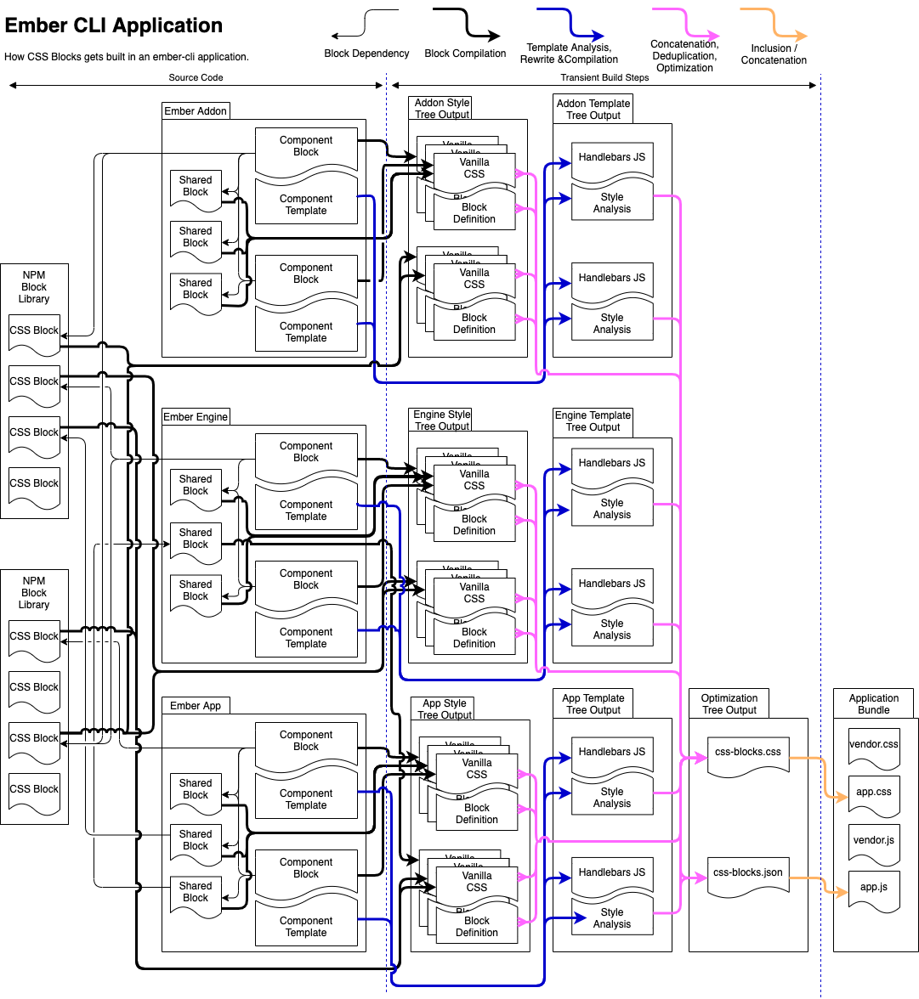

# Request For Comments: Ember Integration for CSS Blocks v2.0

# Summary

The current ember-cli integration was built to make it possible for ember
applications to adopt css blocks so the application code would already be
written with css-blocks in mind while we followed up with a more robust
implementation that would meet all of the use cases well.

The time has come to take that next step towards making ember-cli integration
with CSS Blocks work great.

# Motivation

One of the challenges we've faced with making CSS Blocks work in an ember application is that addons are compiled independently and prior to the build for the main application. To make CSS Blocks work we bypassed the normal build system to hand css block files from addons to the main application and let the application compile them. This is problematic for a few reasons:

* Caching (especially persistent caches that live across processes) was basically impossible.
* Related to caching, broccoli trees are invalidated and rebuilt according to whether there's been any changes to their input trees. When trees have output that's not based on their input tree, it forces the plugin to opt out of intelligent rebuilds.
* As CSS Blocks ages and we have new releases, objects passed across the boundaries of package instances might be incompatible.
* Similarly, if some syntax is removed from css-blocks in a major version release that application would not be able to consume blocks built for an earlier major release.
* To prepare for embroider, CSS Blocks needs to be able to produce output that could work if that code was built in a precompilation of the addon prior to publishing. In that world, css-blocks should be only a dev dependency for addons.

# Goals

This project will be successful if it meets the following criteria:

* Stable, incremental builds that can do minimal work when block files or the
  templates that depend on them change.
* Have an architecture that is amenable to aggressive, persistent caching.
* Unblocks Embroider Support (Pre-built addons and engines).
* Has a clear, testable contract between addon output and application inputs, including support and test matrices for older instances of CSS Blocks code.
* Works well with addons that are using `yarn link` to develop in tandem with an application.
* Unblock the planned "Block Passing" capability.
* Both lazy and eager engines are working.

# Summary of Architectural Changes

1. Block Definition Files &mdash; This project will introduce the concept of a block definition file that, in conjunction with a compiled block stylesheet, allows the two files to be parsed into a Block instance. Like sourcemaps, these definition files can be a linked external file or inlined into the compiled css file as a comment.
2. Single-pass Block Template Analyzer & Rewriter &mdash; A single pass template analyzer and rewriter is made possible because of a novel approach to rewriting that allows us to late-bind the aspects of the rewrite that depend on optimization and knowing the whole state of the application.
3. Aggregate Rewriting &mdash; The rewrite information from both CSS Blocks and opticss is aggregated into a single data file that allows the optimization program that selects output classnames to run based on the runtime style state of the element that invoked it. By aggregating all rewrite information into one place, we can build a more optimal rewriter, enable block passing, and make possible the single pass template analyzer and rewriter.



# High-level Design

## Block Definition Files

Credit: This is a good idea borrowed from TypeScript.

A block definition file is a slimmed down version of a CSS Block. Most of the declarations are removed as well as any at-rules. Some additional information that isn't present in a normal block file is added.

When compiling a CSS Block we will be able to optionally produce a definition file. If a definition file is produced, the CSS file will be annotated with a magic comment that contains a reference to the block definition file.

If needed, like sourcemaps, the magic comment reference to the definition file can actually be the inlined content of the file. This facilitates use cases where passing around two files isn't feasible.

When loading a css file as a block, the magic comment is looked for and if found, triggers a different parsing mode that uses both files to reconstruct the Block.

## Single Pass Template Rewriting

In our current architecture we must analyze all templates and compile all the block files they consume, then optimize the CSS, and finally we rewrite the css and templates accordingly. These two passes, coupled with the need to have analyzed all the css and templates in the entire application and all addons before doing the template rewrite makes the CSS Blocks integration a poor fit with the design and expectations for how builds should work in ember-cli.

Additionally, although the ember-cli code currently runs build steps in a certain order, there's no guarantees regarding build order of say, stylesheets or templates (future releases of ember-cli might parallelize those steps; change the order; or as is the case for embroider, run some build steps at publish time instead of application build time).

To address these problems we will create a single-pass template rewriter.

This new rewriter will rewrite the template and as a side-effect, produce data that is later consumed to optimize the css classes used at runtime. The way this is accomplished is by making every element that uses css-blocks styles make a call to a helper that returns the runtime classnames.

The css blocks helper takes as input, the current styles being used and returns as output the runtime classnames.

The helper reads from a data structure that provides
efficient lookups of the runtime style information.

The contract of that css blocks helper will also enable block passing by making both the base block and the runtime block parameters to the helper.

## Aggregate Rewriting

The current approach to stylesheet optimization requires template rewriters that invoke a helper. That helper is a [virtual machine](https://github.com/linkedin/css-blocks/blob/master/packages/%40css-blocks/runtime/src/index.ts#L37-L107) that takes as input the current state of possible "author-desired styles" as well as instructions for producing the optimized state.

In this new design, the instructions that run on the the virtual machine to produce output styles will no longer be co-located with the call to the helper. Instead, instructions to the virtual machine will be produced at the end of the build once all the templates and stylesheets have been processed. The helper will have access to those instructions and know which of them to run based on the inputs provided.

It should be noted here that production of runtime styles for a given set of CSS Block styles is produced using this optimization infrastructure even when opticss is disabled. This is how CSS Blocks handles concepts like style inheritance, style composition, and style aliases (all of which boil down to: "application of style A implies application of classnames X, Y, and Z")

# Detailed Design

## Detailed Design of Block Stylesheet Precompilation

### Compiled Block CSS format

The goal of the compiled Block CSS file format is to

A compiled block takes the following basic form:

```css
/*#css-blocks <block-id>*/
... compiled output ...
/*#blockDefinitionURL=pathToBlockDefinitionFile.block*/
/*#css-blocks end*/
```

There's three magic comments, let's walk through what they do:

* `/*#css-blocks <block-id>*/` &mdash; Indicates that the CSS that follows has been statically analyzed compiled by css-blocks. The block id must be 128 bytes or fewer.
* `/*#blockDefinitionURL=pathToBlockDefinitionFile.block*/` &mdash; relative path to a block definition file or an inline url containing a base64 encoded file contents. The form of an inline URL for a block definition file is `/*#blockDefinitionURL=data:text/css;charset=utf-8;base64,<encoded-data>*/`.
* `/*#css-blocks end*/` &mdash; marks the end of content compiled by css blocks.

Additionally, the compiled output file may have a magic comment for an associated sourcemap.

### Block Definition File

A block definition file is a legal CSS Blocks stylesheet for the block but all unnecessary rulesets and declarations and at-rules are removed.

The block definition file can be considered a serialization of the parsed Block's datamodel.

The block definition file differs from the source file in the following ways:

* `@block`, `@export` &mdash; The path to the block file is now the relative path to the file that the block was compiled to.
* `:scope` &mdash; A block-specific declaration of `block-id` with a quoted string value of the block's unique identifier (this id will match the block-id associated with the `css-blocks <block-id>` comment)
* `resolve()` declarations &mdash; The value of the block's declaration is now stored in the css file. In the definition file we replace this block's declaration's value with `resolve-self()` to indicate the relative precedence of that block.
* `@block-debug` at-rules are processed during compilation and removed.
* `block-class` &mdash; This block declaration is only valid in a definition file. Each block style will have the CSS class name to which it was compiled set explicitly. These names might differ from the names that would be generated by the options the current process is using.
* `@block-syntax-version` - This at-rule is allowed in block declaration files to describe the syntax version of css blocks it uses. This version will be incremented when any syntax is deprecated. Codemods will transform old versions of the syntax into the current version before parsing it. In this way, our parser will not have to support more than the currently deprecated features and published code can be loaded without issuing unfixable deprecation warnings.

The block definition file may have a sourcemap with mappings back to the original source file.

### Miscellany

* `@block-debug <block> to comment;` &mdash; The output comment goes into the compiled stylesheet, it does not go into the block definition file.
* Provide a public API for getting a list of all files related to the compilation of the block file (inclusive of both block stylesheets files as well as all dependencies).

#### Example

Consider the following source file:

```css
@block link from "../shared/link.block.css";
@block list from "../shared/list.block.css";
@export item from "item.block.css";

:scope {
  block-alias: top-nav;
  block-name: nav;
  extends: list;
  display: flex;
}

.entry {
  block-alias: top-nav-entry;
  flex: 1;
}

.entry[active] {
  font-weight: resolve("link");
  font-weight: bold;
}

.entry:hover {
  text-shadow: 2px 2px 1px;
}

@block-debug self to stderr;
```

It would compile to:

```css
/*#css-blocks 7d97e*/
.nav-7d97e {
  display: flex;
}
.nav-7d97e__entry {
  flex: 1;
}
.nav-7d97e__entry--active {
  font-weight: bold;
}
.nav-7d97e__entry--active.link-3c287 {
  font-weight: bold;
}
.nav-7d97e__entry:hover {
  text-shadow: 2px 2px 1px;
}
/*#blockDefinitionURL=nav.block*/
/*#css-blocks end*/
```

And to the following definition file:

```css
@block-syntax-version 1;
@block link from "../shared/link.css";
@block list from "../shared/list.css";
@export item from "item.css";

:scope {
  block-id: "7d97e";
  block-class: nav-7d97e;
  block-alias: top-nav;
  block-name: nav;
  extends: list;
}

.entry {
  block-alias: top-nav-entry;
  block-class: nav-7d97e__entry;
}

.entry[active] {
  block-class: nav-7d97e__entry--active;
  font-weight: resolve("link");
  font-weight: resolve-self();
}
```

#### Parsing a Compiled Block

When parsing a stylesheet as a block, the file is first scanned for a magic `blockDefinitionURL` comment. If the URL is a data url, it is unencoded into the block definition file's content. If the url is a relative path, the definition file is loaded from that location. If the URL has a protocol or is absolute it is considered invalid.

The definition file is parsed as a block normally would be with the following differences:

* Before parsing, the definition file is scanned for a `@block-syntax-version` at rule and automatically upgraded to the current syntax using a codemod for each version bump.
* The `block-class` declaration will set the style's class name, overriding the class name it would normally be assigned given the current configuration. If not parsing a declaration file, this property would cause an error.
* The block's unique identifier is assigned from the `:scope` selector's `block-id` declaration, rather than being generated. If not parsing a declaration file, this property would cause an error.

Once the block definition file is parsed, the compiled output is parsed to load in the ruleset information for property conflict detection. The process for parsing these rulesets is the following:

For each selector in each rule:

    1. Find the key selector
    2. Find all the classnames in the key selector
    3. If there is more than one classname, it is a resolution selector: skip it because the definition file will have addressed that.
    4. If there is no classname, it is an error.
    5. Use the classname to reverse lookup the block style associated with it, if not found, it is an error.
    6. Add the ruleset (`RulesetContainer.addRuleset`) to that style.


## Detailed Design of Single Pass Template Rewriting

### Ember-CLI Integration

The current ember-cli integration will be re-written to be more in line with how ember-cli expects addons to work. In particular, we will no longer use shared memory to transfer css files and analysis information from addons to the main application which bypasses ember-cli's broccoli trees as the approved method of transferring files from addons to the main application.

By doing so and by building on top of existing broccoli plugins, CSS Blocks will get persistent caching and faster rebuilds, which are very important for large applications like voyager-web.

#### `@css-blocks/ember`

A new ember-addon named `@css-blocks/ember` will be created. This library will be a runtime dependency for any addon, engine or application that has stylesheets and templates built with CSS Blocks. When we support embroider, this addon will enable the precompilation of addons and engines at publish time.

Block stylesheets and templates are both compiled during the template processing phase
of an ember build target (could be an app, engine or addon). This is accomplished by
providing the following hooks:

1. `preprocessTree(type, tree)`
  1. `type` = `'template'` the tree returned monitors the input tree for the deletion of handlebars templates so we can delete corresponding analysis files from the post template tree during template postprocessing.
  2. `type` = `'css'` the tree returned is a broccoli-funnel that filters out any css block stylesheets from the addon's CSS output. This is because blocks are compiled during template processing and their built output is placed in the tree containing compiled template.
2. `setupPreprocessorRegistry(type, registry)` - For `type` of `"htmlbars-ast-plugin"`, we register an AST plugin that rewrites the template so that css-blocks syntax is removed and is replaced by helper function invocations for the value of the html class attribute.
3. `postprocessTree(type, tree)` - For `type` of `"template"`, the tree returned emits a serialized analysis for each handlebars file that is processed by the ast plugin. It also emits compiled css block files that were used by the templates that were rewritten. The CSS Block files that are compiled should include an inline block definition file.

Because these trees operate sequentially, we're guaranteed to have the template preprocessTree run before the htmlbars AST plugin which will run before the postprocessTree. In order to make these three steps work together a `CompilationManager` object will be created for each "leaf" and to which all three components hold a reference. While this sounds like the thing we were trying to get away from, the out-of-band communication that occurs here will be very well behaved because the trees involved don't cross any software package boundaries and share rebuild input events with each other.

#### `@css-blocks/ember-app`

This ember-cli addon is responsible for bringing together the output from from `@css-blocks/ember` into a single location within the application, deduplicating files, running the optimizer, and ensuring the rewrite data is accessible to the runtime css-blocks helper.

This addon will use the `preprocessTree('css', tree)` hook for the application. This tree is special because it contains a subdirectory named `addon-tree-output` where each subdirectory is the build results per addon. It also includes the application's css that is about to be compiled. However, because the `@css-blocks/ember` addon does its work during the template phase, the blocks and templates of the application will have already been analyzed and compiled allowing them to be treated just like
the files from the addons.

This addon will install a broccoli plugin that performs the following actions:

1. Find CSS files that contain `/*#css-blocks <block-id>*/` on the first line (because the block-id has a max length, we need only read the first 144 bytes of the file). If the magic comment is present and the block-id has not been encountered, read the whole file and it to the optimizer. If the block-id has been seen already, discard it. Don't transfer any files that were compiled from css-blocks to the output tree. (Note: We probably need to parse these compiled block files back into blocks, but we might be able to avoid it in the future.)
2. Find all the serialized template analysis files, deserialize them and add them to the optimizer. Don't transfer the template analysis files to the output tree.
3. Run the optimizer and write the optimized stylesheet to a single CSS file in the application's styles directory (css-blocks.css). (Note: This file should be concatenated with the applications' other stylesheets. It should come after any resets and before any non-css-blocks styles.)
4. Produce the data file that the css-blocks runtime helper will use to rewrite styles for each element. TODO: Figure out how to best get that file into the application bundle. We might need use the `app.postProcessTree('all')` hook to inject a "define" into the file into the application's JS bundle.

A few things to note:

* Because we inject the `css-blocks.css` file during `app.preprocessTree('css')`, it means the css-blocks file will be processed like other css files in the application. It will be minified. It will be language optimized and rtl-flipped. It will be autoprefixed, etc. This is desired.
* This approach means that blocks are parsed at least twice for each build. As an optimization, it's possible that we can find a way to share a block factory for each build/rebuild that will allow us to skip re-parsing the blocks, but we need to plan for the general case where the blocks come to use from cache or from having been precompiled in an embroider build. It's also possible that some addons will be built with different versions of `@css-blocks/ember` and cannot share a factory. In cases like these, the blocks will need to be restored from a compiled css block file.

### Design for Rewrite Helper Invocations

Consider an element `<div nav:scope nav:type={{@navType}} dropdown:class="trigger" dropdown:disabled={{@isNavDisabled}}>`. This element has two styles that are always applied (the two classes), a choice of one of several styles for the nav type, and one style that is conditionally applied. Ultimately these styles are transformed into css classnames. The rewrite helper takes as input which styles are applied and it returns css classnames that should be used.

The invocation of a helper is a list of arguments that specify which styles might be applied and provides the runtime values to determine which are currently applied.

The arguments take the following format:

`numBlocks` `[block definition]+` `numStyles` `[style definition]+` `numConditions` `[condition definition]*`

Where each of the named groups of arguments above is a set of arguments with
a predictable length.

* block definition: `sourceBlockId` `runtimeBlockId` - Where each block identifier is either a number or a string. If there's no runtime block swapped out for the sourceBlock, the `runtimeBlockId` is passed as `null`. Each block definition is assigned a local reference index starting with `0` and incrementing by `1` in order.
* style definition: `blockDefinition` `styleId` - Where `blockDefinition` is the reference index of a prior block definition. The `styleId` is a number that uniquely identifies that style within the source block of the block definition. Each style definition is assigned a local reference index starting with `0` and incrementing by `1` in order.
* condition definition: The first argument indicates what kind of condition. The type of a condition definition determines the length of the definition. The following types are allowed:
  * `1 styleDefinition` - A style that is always applied. The second argument is the index of the style definition that is always applied.
  * `2 styleDefinition subExpressionResult` - A style that can be toggled. The style at index given by `styleDefinition` is only applied if the value at `subExpressionResult` is considered "truthy".
  * `3 numValues subExpressionResult [value styleDefinition]+` - A style is selected from a map of value to styleDefinition reference. `numValues` is the number of pairs in the style map. `subExpressionResult` must be a string or `null` and if it's a string, that string must equal one of the values, when it does, the `styleDefinition` is applied to the element. If it's null, then no style is applied. If one of the values is null, then that style is applied when the sub expression result is null. If the value is non-null and doesn't match a value, an error is thrown.

Returning to our example above, the rewrite looks like this:

`<div class={{-css-blocks-classes 2 "nav" null "dropdown" null 6 0 0 0 9 0 10 0 11 1 4 1 7 4 1 0 1 4 2 5 @isNavDisabled 3 3 @navType "side" 1 "top" 2 "hamburger" 3}}>`

Let's break that down:

1. `2 "nav" null "dropdown" null` - There are two blocks. "nav" is block #0. It is not substituted. "dropdown" is block #1; it is not substituted.
2. `6 0 0 0 9 0 10 0 11 1 4 1 7` - The first number means there are `6` styles that might be applied.
    1. `0 0` - The `"nav"` block's `:scope` style has the id 0. This is style definition 0.
    2. `0 9` - The `"nav"` block's `:scope[type="side"]` style has the id 9. This is style definition 1.
    3. `0 10` - The `"nav"` block's `:scope[type="top"]` style has the id 10. This is style definition 2.
    4. `0 11` - The `"nav"` block's `:scope[type="hamburger"]` style has the id 11. This is style definition 3.
    5. `1 4` - The `"dropdown"` block's `.trigger` style has the id of 4. This is style definition 4.
    6. `1 7` - The `"dropdown"` block's `.trigger[disabled]` style has the id of 7. This is style definition 5.
3. `4 1 0 1 4 2 5 @isNavDisabled 3 3 @navType "side" 1 "top" 2 "hamburger" 3` - There are `4` conditions specified.
    1. `1 0` - The style definition `0` is always applied.
    2. `1 4` - The style definition `4` is always applied.
    3. `2 5 @isNavDisabled` - The style definition `5` is applied if the result of `@isNavDisabled` is truthy.
    4. `3 3 @navType "side" 1 "top" 2 "hamburger" 3`. The first `3` means his is a style selector. There are `3` values to select from. The value returned by `@navTap` is a string. If the value is `"side"` then style 1 is applied. If the value is `"top"` then style 2 is applied.If the value is `"hamburger"` then style 3 is applied.

Implementation Note:

* If, as you lookup styles on their respective blocks, you just push the styles onto an array, later the conditions will tell you what indices of that array are applied on the element.
* To lookup a block that's overridden, the metadata will need to contain a mapping from interface block's style ids to that concrete block's style ids.

Caveat: Although this helper will support block passing in its interface, no implementation of block passing will be built. If a non-null value is received in the current implementation, an error will be raised.

## Detailed Design for Aggregate Rewriting

TODO: The detailed design for Aggregate Rewriting is not yet complete.

## How do we teach this?

This doesn't change the developer experience of working with CSS Blocks.

The installation instructions for getting started with css blocks will need to change.

Upgrading will require upgrading the application and the addons in unison, because we don't plan to be backwards compatible with the old implementation.


[bpf]: https://github.com/broccolijs/broccoli-persistent-filter